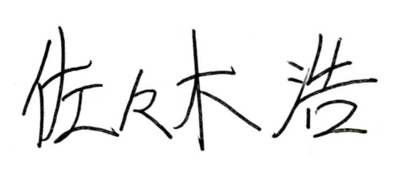

# 「カワウソを守るために」我々ができることをする

日本アジアカワウソ保全協会は、アジアを中心とする世界のカワウソ保全を目的とし、研究、普及啓発、そして世界のカワウソ研究者たちとの協力をより積極的に行うため設立されました。

近年、日本ではカワウソに関して大きな動きがあり、対馬におけるユーラシアカワウソの発見という喜ばしい出来事があった一方、東南アジアから輸入したコツメカワウソのペット飼育、カワウソカフェの増加など、いわゆる「カワウソブーム」とも呼べる社会現象がみられます。そして、残念なことに、その需要に目をつけた密輸事件も多くなりました。

日本列島のカワウソはすでに1979年の目撃を最後に姿を消し、環境省から正式に絶滅が宣言されています。このような悲劇を二度と繰り返さぬよう、国内外のカワウソを守り、そして、その重要性をみなさんに伝えていくために、日本のカワウソ研究者たちが中心になってこの協会を設立しました。 カワウソにばかされているかも知れない我々に、何をどこまでできるのかは分かりません。しかし、地球全体の環境悪化が進み、未曾有の大量絶滅が起きている今、できる限りの行動を起こさねばカワウソだけでなく多くの生命が失われ、やがて我々人類自身にも影響が及ぶでしょう。次世代のため、カワウソと人類が共生する明るい未来を我々と共に創りましょう！

