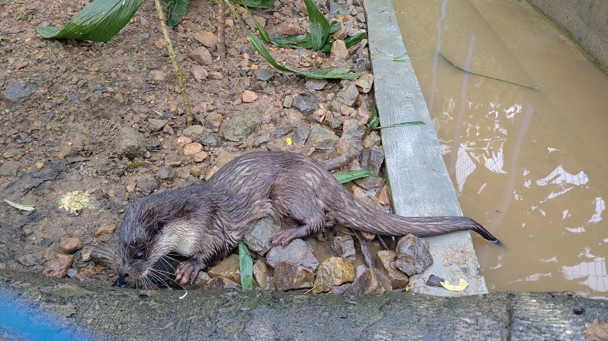

こんにちは。本協会で理事を務めさせていただいております、和久大介（わくだいすけ）と申します。現在は大学で教鞭をとりつつ、本協会にてカワウソ保全に微力ながら協力させていただいております。学生時代からカワウソの研究を行っており、本協会執行部メンバーの多くが所属している国際自然保護連合・種の保存委員会・カワウソ専門家グループ（IUCN/SSC/OSG）のメンバーにも入れていただいております。

今回は、昨年スマトラ島で見つかったユーラシアカワウソ*Lutra lutra*について報告させていただきます（<https://ocsj.asia/2019/12/donation-indonesia/>）。本協会が標榜する調査・研究を通してみなさまにカワウソ保全の重要性や、意外な緊急性をご理解いただければ幸いです。

また、本報告は昨年に本協会を通して寄付していただいた「インドネシア・スマトラ島のカワウソレスキュー活動支援」に関する第一報ともなります。これからも活動を続けてまいりますが、寄付をいただいたみなさまに感謝申し上げます。

# 約一世紀無かった生息情報

インドネシアのスマトラ島はその北端をマレーシア半島の西側に位置し南方向に長い形をしています。このスマトラ島は島国インドネシアの一部ですので、もちろんユーラシア大陸とはつながっていません。しかし、1820年代のCuverによる記録ではユーラシアカワウソが報告されています。ちなみにスマトラ島のユーラシアカワウソは東南アジア亜種*Lutra lutra barang*を記載したものに書かれており、標本はジャワの博物館に送られたとされていますが所在は不明。その後も1940年ぐらいまで記録はありますがぱたりと情報がありませんでした。さらには半島マレーシアを長く調査されている当協会理事長の佐々木浩先生も「半島マレーシアにはユーラシアカワウソは分布していないだろう」という結果を出しつつあります。こういった複数の状況から「ほんとうにスマトラ島にユーラシアカワウソがいるのか？」と我々は思っていました。そんな思いを一瞬で吹き飛ばすことが起きました。2019年11月にインドネシアのOSGメンバーから「ユーラシアカワウソっぽいカワウソが保護されたんだけど」と連絡が入ったのです。対馬のようなカワウソショック再び。

# ほんとうにユーラシアカワウソ

冒頭にも述べましたように、今回保護されたカワウソについては寄付金をもとに現地で保護・飼育が維持されています（1月末に訪れた際の旅費等は別途個人の資金で実施しております）。今回のユーラシアカワウソはスマトラ島のメダンにて違法飼育されていた保護個体のために実際の出自は分かりません。しかし、スマトラ島は違法捕獲（密猟）・販売の発信地であり、日本のような海外からの受け入れ地ではありません。確証はありませんが、スマトラ島北部で捕獲されてメダンに集まってきた違法捕獲の動物たちと同じ境遇と考えられます。このようにスマトラ島の出身である可能性は高いですが、出身の詳細は分からないため遺伝的なかく乱や、生息環境の適性が分からないためなかなか自然に帰しにくいのが現実です（現地の意志としては帰せるなら自然に帰したいようです）。

ちなみに彼（カワウソ）は一時期体調不良の時期もありましたが今は元気も元気、しっかり食事して、ぶりぶりうんこしているようです。

# カワウソが保護されているNGO

今回カワウソが保護されている場所はメダンから車で3時間ほど移動したブキットラワン（Bukit Lawang）です。ブキットラワンはオランウータンツアーでも有名な場所ですが、ここで活動しているNGOの代表がBobiさんです。Bobiさんのグループは宿泊施設「Bukit Lawang Hill Resort」の収益を主な活動資金に、違法捕獲・飼育された動物の保護・自然復帰を行っています。反社会的組織を敵に回し殺害予告を何回もされながらも、銃を携行した森林警察の助けも借りながらコブラから鳥類・哺乳類まで幅広く保護に対応されています。

宿泊施設はNGOの活動拠点にもなっているので、宿泊していると違法捕獲・飼育から救出された動物たちが毎日のように保護されてきます。その様子は、密輸され日本に来ている動物たちの比にならないぐらい・とんでもなく沢山の動物が違法捕獲されていることを、まざまざと見せつけてくるものでした。

水シャワー（気温が高くあまり気にならない）や東南アジアのトイレに耐えられる方は、Bibiさんたちの活動を宿泊費で応援するという目的でBukit Lawang Hill Resortを訪問していただくのも良いかもしれません（保護の関係上訪問されてもあまりネット上に情報は出さないほうがいいかもしれません。）。インドネシア人以外は予約なし当日訪問で泊っている方が多いようです。そして丘の上にある宿からの眺めはなかなか良いです。



# 簡単にはいかない遺伝子検査

インドネシアは遺伝子資源の海外持ち出しに特に厳しい制限を掛けている国の一つです。インドネシアの研究機関に正式な協力者がいたとしても、国などへの事務手続き完了は最短半年と言われています。今回は急遽対応したこともあり、遺伝子検査のために試料を持ち帰ることはできませんでした。そこで我々はインドネシアの首都ジャカルタにある研究機関での遺伝子検査を目指しています。全世界に広がっているCOVID-19の影響が落ち着き、国の行き来が容易になった際は再びインドネシアを訪問し、このカワウソの正体に迫りたいと思います。

# Report of Eurasian otter *Lutra lutra* of Sumatra island

Last year (2019), Eurasian otter *Lutra lutra* was found and taken from illegal keeping in Sumatra island, Indonesia. This is the first report of this individuals that donated found for care center of NGO from Japanese. We visited Sumatra island in January and check that looks and behavior, we confirmed this otter as Eurasian otter without an evidence of DNA. This Eurasian otter is the first record of this century, in more than 80 years in Sumatra islands. We will do check the DNA of this otter in a non-invasive way in Jakarta after the corona virus crisis.

I was then much surprised that much be seen to be believed number of animals were hunted by illegal hunter on Sumatra islands, do to not only mammals (include otters) but birds and reptiles. Hence, we must do action for conservation for Indonesian animals more.